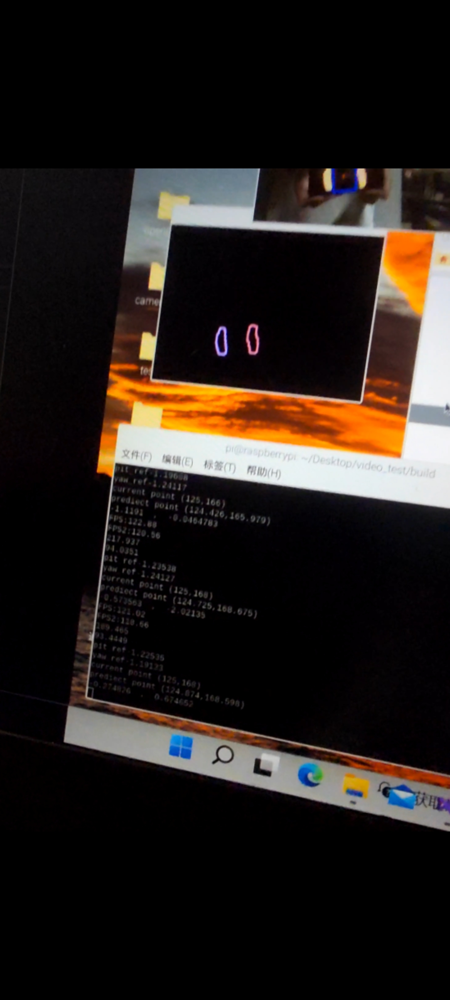
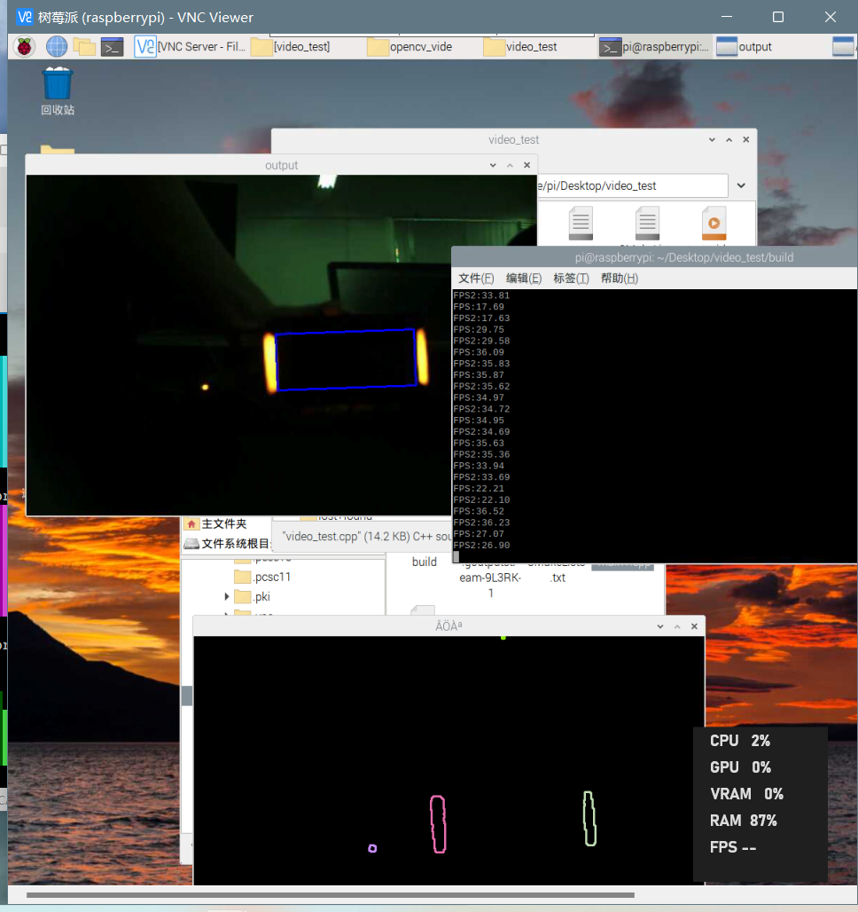
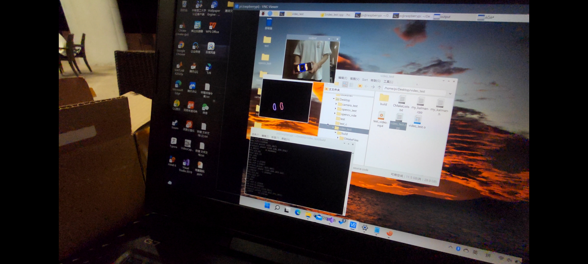

# 大佬说得队视觉开源

## 致谢


## 说明


## 目录

[1.主要功能介绍及效果展示](#1主要功能介绍及效果展示)

[2.依赖环境](#2.依赖环境)

[3.整体框架](#3.整体框架)

[4.实现方案及原理介绍](#4.实现方案及原理介绍)

[5.未来展望](#5.未来展望)


## 1.主要功能介绍及效果展示

- **装甲板识别跟踪：** 主要分为预处理、灯条检测、装甲板检测、择优、扩展、角度解算这六个部分。预处理部分使用的就是InRange和二值化，灯条检测和装甲板检测基本上都是长宽比等常用的筛选调剂。不管在测试视频还是实机测试中中基本能够跑满相机帧率（30FPS），所以就没有再继续加ROI了。
- 

<center>
图1-1 树莓派实机识别装甲板
</center>  



<center>
图1-2 树莓派实机识别装甲板参数(抱歉因为是截图，所以不是很清晰)  
</center>  




 <center>
图1-3  树莓派实机运行测试视频（可见帧率基本稳定30帧）
</center>  


- **符文板识别：** 符文板依然使用的是一些特征筛选，符文板长宽比、符文板角点数等。根据检测顺序，每一次都会击打最靠右端的符文板，当其熄灭以后就会自动转向下一个最右端符文板

  

  

  


## 2.依赖环境

- **硬件**

| 硬件     | 型号                      | 参数                                                         |
| -------- | ------------------------- | ------------------------------------------------------------ |
| 运算平台 | **Raspberry Pi** Zero 2 W | CPU：博通BCM2710A1（BCM2837）（4×1GHz Cortex-A53） GPU：博通VideoCore IV 内存：512MB LPDDR2 存储：32GB 网络：2.4GHz 802.11b/g/n Wi-Fi、蓝牙4.2 接口：Mini-HDMI，Micro-USB 2.0 OTG、相机串行接口（CSI）、40针GPIO接头 尺寸：65×30毫米（约2.56×1.18英寸） |
| 相机     | 杰瑞微通DF200             | 分辨率1080p，最高帧率30fps                                   |
| 镜头     | \                         | 3.6mm定焦                                                    |

- **软件**

| 软件类型 | 型号版本                 |
| -------- | ------------------------ |
| OS       | Raspberry Pi OS (64-bit) |
| Eigen    | EIGEN_3.4.0              |
| Library  | OpenCV 4.5.5             |

## 3.整体框架

```
│  main.cpp                            // 主函数
                
├─ArmorDetector                        // 装甲板检测相关
│      ArmorDetector.cpp               // 装甲板检测源文件
│      ArmorDetector.h                 // 装甲板检测头文件
├─serial                               // 通信相关
│      serial.cpp                      // 通信源文件
│      serialr.h                       // 通信头文件
├─kalman                               // 预测相关
│      kalman_xbot.cpp                 // 预测源文件
│      kalman_xbot.h                   // 预测头文件
```

## 4.实现方案及原理介绍

#### **装甲板识别：**


装甲板识别主要识别机器人最明显的灯条部分，而识别灯条则分为预处理和特征提取两大部 分，首先对图像进行预处理，接着对处理后的图像进行特征提取提取灯条，找到符合条件的 灯条后对灯条间拟合装甲板。


**装甲板识别逻辑流程图**

****


<center>
图4-1 装甲板识别逻辑流程图  
</center>  


**1、预处理**

预处理部分主要是将图像二值化，而二值化的关键就在于阈值，这里我们先将图像转化为hsv色彩空间并采用了InRange函数，前期其排除精度不高，后来经过我们不断的改进与调试，发现在Scalar(11, 43, 46), Scalar(34, 255, 255)这个区间对橙色也就是视频中的灯条判别精度很高；在Scalar(100, 100, 100), Scalar(124, 255, 255)对于蓝色符文板（我们自己用这个颜色来测试）判别精度很高。这个方法可以将绝 大多数不发光的物体排除在外，在后面处理轮廓环节能节省较多时间。

**2、特征提取**

特征提取部分主要是对轮廓进行处理，首先一次筛选，使用传统方法过滤大部分明显不是目标的区域，为后续的分类减小干扰和运算量；然后二次筛选找出敌方颜色的灯柱；最后根据灯柱两两匹配找出所有待定装甲板，并选择最优目标进行辅助瞄准。



<center>
图4-2  树莓派实机运行测试（可见帧率稳定、识别清晰）
</center>  

**1）一次筛选**

- 对所有轮廓长度进行筛选，大于最大阈值或小于最小阈值轮廓排除；
- 对所有轮廓最小包围矩形长宽比进行筛选，大于最大阈值或小于最小阈值轮廓排除；
- 对所有轮廓面积进行筛选，大于最大阈值或小于最小阈值轮廓排除；
- 对轮廓矩形度（轮廓面积与轮廓最小外包矩形面积之比）进行筛选，大于最大阈值或小于最小阈值轮廓排除；
- 对轮廓似圆度（轮廓面积与轮廓长度之比）进行筛选，大于最大阈值或小于最小 阈值轮廓排除；
- 多边形逼近，将轮廓拟合多边形，对多边形顶点数量做筛选，小于阈值轮廓排除。

**2）二次筛选**

- 对轮廓外包矩形进行角度筛选，偏移角过大则排除；

- 对轮廓颜色进行筛选，利用轮廓外包矩形四个点的坐标在原图中计算 b 通道和 r 通道的像素差值，筛选出敌方颜色灯柱。（后期排除了这种算法）

**3）装甲板检测**

- 对灯条两两匹配；
- 拟合包含两灯条在内的最小矩形，对矩形面积进行筛选，小于最小阈值则排除；
- 利用两灯条计算出中间装甲板 4 个顶点位置；
- 对装甲板矩形宽高比进行筛选；
- 找到装甲板。

###### 树莓派实机装甲板检测视频


<center>
图4-2  树莓派实机运行测试视频（可见帧率稳定、识别清晰）
</center>  

**目前仍存在的问题**

- 灯条变形问题，当灯条成为椭圆状时，已经背离了我们的识别逻辑。由于灯条发光，降低相机的曝光时间能够一定程度上缓解这种现象，但是这样也不是特别理想。


- 场地灯光误识别问题，这是一直以来都有的问题，是很难避免的。只有通过不断地调试来使其精度提高


**符文板识别思路：**

- 1 输入图片；

- 2 预处理：
  
  - 2.1 根据目标颜色，使用InRange函数得到对应的灰度图。
  - 2. 2对灰度图进行阈值分割，得到最终的二值图。

- 3 特征提取（检查装甲板）：
  
  - 通过识别到的轮廓集，遍历轮廓集，拟合出外包矩形，进行轮廓长度、矩形长宽比、面 积比（轮廓面积 / 外包矩形面积）、轮廓面积等条件的阈值比较，筛选出符合条件（与装甲板相似）的轮廓；
  
  

#### **预测**

- 通过卡尔曼滤波实现预测：
  - 输入当前帧，上一帧，上上帧中符文板的三个位置
  - 预测部分使用运动学公式，通过计算其速度、加速度的方式预测其下一帧位置
  - 更新部分使用卡尔曼滤波公式
  
  

#### **通信**

- 树莓派通过串口通信的方式以16进制方式收发数组与STM32进行通信：
  - 当树莓派接收到STM32发出的发送数据的指令后
  - 将由卡尔曼滤波处理后得到的数据进行解算并放入预发送数组
  - 通过串口向STM32发送目标俯仰角与偏航角


## 5.未来展望

- 提升pnp算法解算精度
- 对移动目标，继续研究或发现新的解决方案，提高击打移动目标的命中率；
- 改进阈值化处理方式，使用通道相减说不定能节省很多时间，继续提高运行效率

